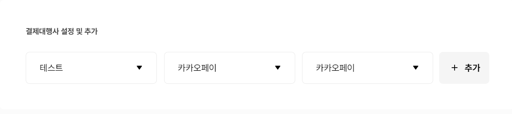

## 1. PortOne

### 1-1. 간단한 연동성

- 포트원은 복잡한 PG결제 연동규격을 누구나 쉽게 연동할 수 있도록 결제창 연동은 JavaScript SDK 형태로 제공한다.
- 포트원을 사용하면 라이버르리 두 줄로 결제창 연동이 가능하다.
- 즉 `따로 모듈을 설치하지않아도` 구현이 가능하다는 큰 장점이 있다.
- 또한 거의 대부분의 결제 대행사를 한 번에 연동가능하다.

### 1-2. 다양한 언어 지원

- `Java, Php, Python, Nodejs`등 다양한 언어를 지원한다.

### 1-3. 결제 데이터를 모니터링해 보안에 강하다

- 모든 결제 정보 암호화
- 결제 정보 위/변조 시도 차단
- 결제대행사 장애 사전 모니터링

위 사항들을 지원해준다.

## 2. 연동 준비하기

우선 [공식문서](https://developers.portone.io/docs/ko/readme)에서 너무나 친절하게 설명되어 있다.

### 2-1. PG 정보 설정

- `결제 연동` => `테스트 연동관리`에서 본인의 `가맹점 식별코드`를 확인한다.(추후에 연동에서 사용해야하기 떄문)
- 이때 `가맹점 식별코드`와 나머지 정보들은 정보가 노출되지 않게 보안을 철저히 한다. 결제 내역을 컨트롤할 수 있는 정보들이 담겨 있기 때문이다.

### 2-2. 결제 대행사 테스트 설정하기

- 사용하려는 대행사의 설정이 필요하다. 본 글에서는 가장 편하게 테스트를 하기위해서 카카오페이로 설정하여 진행하였다.



### 2-3. 코드작성

> Type에 맞게 interface를 설정하여 결제 type들을 정의해주어야한다.

> [공식문서](https://github.com/iamport/iamport-react-example/blob/master/manuals/PAYMENT.md)에서 친절하게 코드도 작성되어있다. 테스트이기에 고객과 결제정보를 임의로 설정하고 진행한다.

```Typescript
//imp.d.ts


export interface RequestPayAdditionalParams {
  digital?: boolean;
  vbank_due?: string;
  m_redirect_url?: string;
  app_scheme?: string;
  biz_num?: string;
}

export interface Display {
  card_quota?: number[];
}

export interface RequestPayParams extends RequestPayAdditionalParams {
  pg?: string;
  pay_method: string;
  escrow?: boolean;
  merchant_uid: string;
  name?: string;
  amount: number;
  custom_data?: any;
  tax_free?: number;
  currency?: string;
  language?: string;
  buyer_name?: string;
  buyer_tel: string;
  buyer_email?: string;
  buyer_addr?: string;
  buyer_postcode?: string;
  notice_url?: string | string[];
  display?: Display;
}

export interface RequestPayAdditionalResponse {
  apply_num?: string;
  vbank_num?: string;
  vbank_name?: string;
  vbank_holder?: string | null;
  vbank_date?: number;
}

export interface RequestPayResponse extends RequestPayAdditionalResponse {
  success: boolean;
  error_code: string;
  error_msg: string;
  imp_uid: string | null;
  merchant_uid: string;
  pay_method?: string;
  paid_amount?: number;
  status?: string;
  name?: string;
  pg_provider?: string;
  pg_tid?: string;
  buyer_name?: string;
  buyer_email?: string;
  buyer_tel?: string;
  buyer_addr?: string;
  buyer_postcode?: string;
  custom_data?: any;
  paid_at?: number;
  receipt_url?: string;
}

export type RequestPayResponseCallback = (response: RequestPayResponse) => void;

export interface Iamport {
  init: (accountID: string) => void;
  request_pay: (
    params: RequestPayParams,
    callback?: RequestPayResponseCallback
  ) => void;
}

declare global {
  interface Window {
    IMP?: Iamport;
  }
}
```

```TypeScript
// payment.tsx

import { RequestPayParams, RequestPayResponse } from "@hooks/imp";

function Payment() {
  const onClickPayment = () => {
    if (!window.IMP) return;
    /* 1. 가맹점 식별하기 */
    const { IMP } = window;
    IMP.init("imp00000000"); // 본인의 가맹점 식별코드를 적는다.

    /* 2. 결제 데이터 정의하기 */
    const data: RequestPayParams = {
      pg: "kakaopay", // PG사의 종류를 선택한다. (https://portone.gitbook.io/docs/sdk/javascript-sdk/payrq#undefined-1)
      pay_method: "card", // 결제수단
      merchant_uid: `mid_${new Date().getTime()}`, // 주문번호
      amount: 1000, // 결제금액
      name: "아임포트 결제 데이터 분석", // 주문명
      buyer_name: "박명수", // 구매자 이름
      buyer_tel: "01012345678", // 구매자 전화번호
      buyer_email: "qwer1234@naver.com", // 구매자 이메일
      buyer_addr: "가양동 42-11", // 구매자 주소
      buyer_postcode: "32192", // 구매자 우편번호
      m_redirect_url: "http://localhost:8080/orderCompleteMobile",
    };

    /* 4. 결제 창 호출하기 */
    IMP.request_pay(data, callback);
  };

  /* 3. 콜백 함수 정의하기 */
  function callback(response: RequestPayResponse) {
    const { success, error_msg } = response;

    if (success) {
      alert("결제 성공");
      console.log(response);
    } else {
      alert(`결제 실패: ${error_msg}`);
    }
  }

  return (
    <div>
        <button
            onClick={onClickPayment}
            className=" my-20 border-2 border-black p-6 rounded-xl"
        >
        결제하기
        </button>
    </div>
  );
}

export default Payment;
```

[참고블로그](https://velog.io/@gunilna/%ED%8F%AC%ED%8A%B8%EC%9B%90-Front-end-%EC%97%B0%EB%8F%99%ED%95%98%EA%B8%B0)
