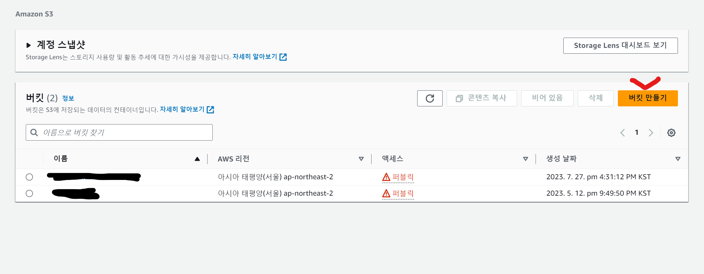
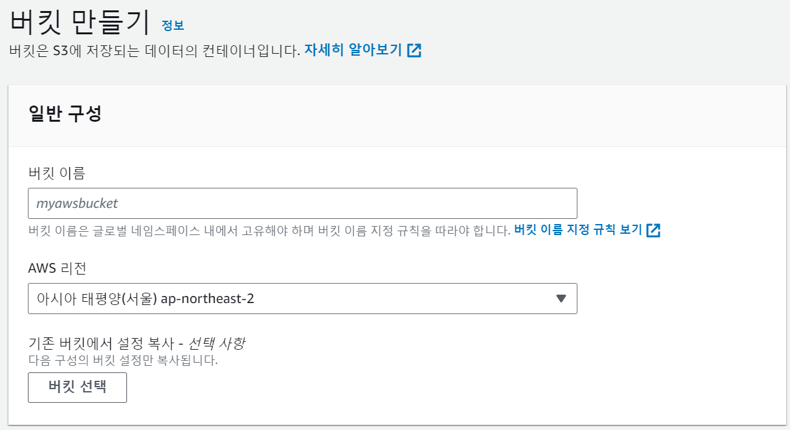
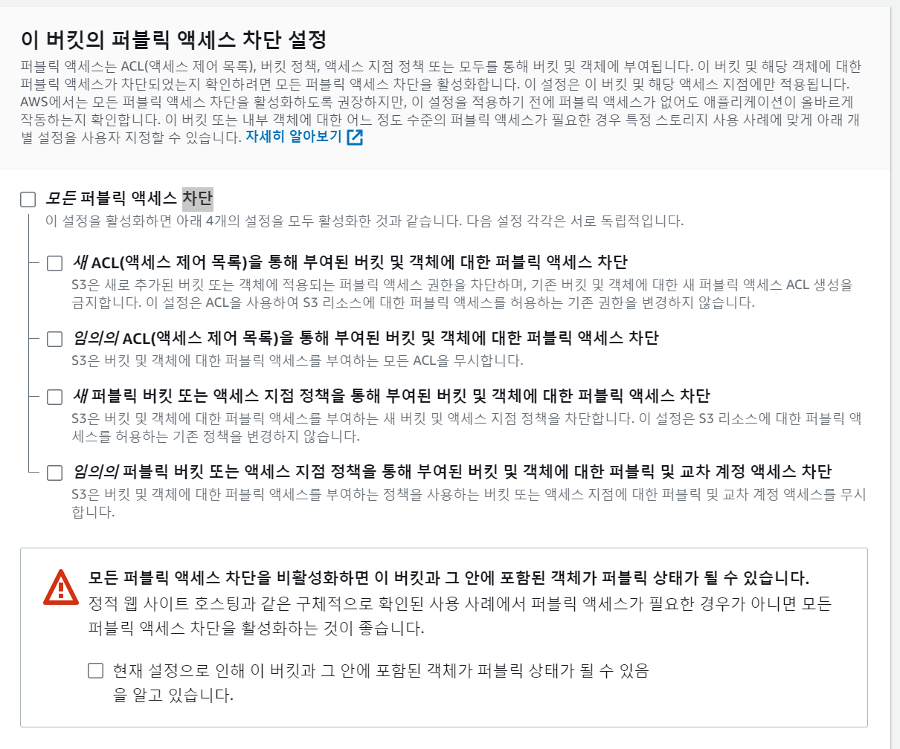
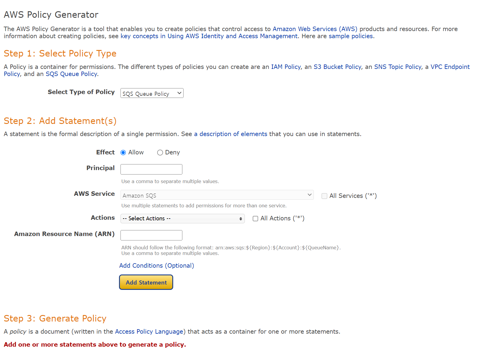
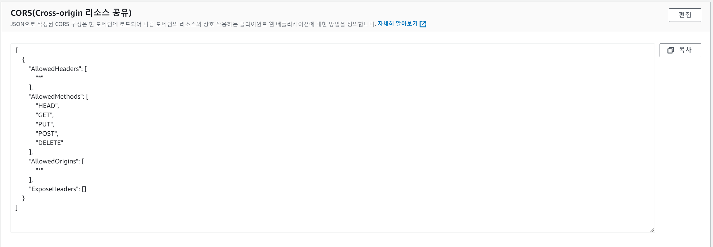
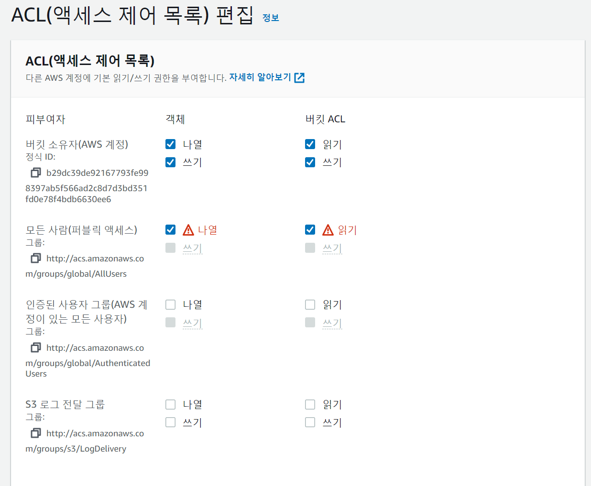

카메라를 이용하여 알약을 찍어, 이를 무슨 약품인지 확인하는 서비스를 구현하던 도중 이미지를 어떻게 서버에 올렸을 때 가장 효율적일지를 고민하던도중, AWS의 S3 BUCKET을 이용하여 이미지를 업로드하는 방법을 찾아보게되었다.<br/>
S3란 `Simple Storage Service`의 약자로 최고의 확장성, 데이터 가용성, 보안 및 성능을 제공하는 객체 스토리지 서비스이다. 일반적인 파일 서버는 트래픽이 증가함에 따라 장비를 증설하는 작업을 해야하는데 S3는 이런 작업을 대행해준다고 한다. 때문에 트래픽에 따른 시스템적 문제를 고민할 필요가 없어지고 접근 권한 또한 설정이 가능하여 보안에도 유리하다.<br/>
S3에서 사용되는 용어들은 아래와 같다.

1. `객체(Object)` : AWS는 S3에 저장된 각각의 데이터를 객체라고 한다
2. `버킷(Bucket)` : 객체(Object)가 파일이라면 버킷(Bucket)은 연관된 객체들을 그룹핑한 최상위 디렉토리라 할 수 있다. 버킷 단위로 사용 지역을 지정할 수 있고, 버킷에 포함된 모든 객체에 대해서 일괄적으로 인증과 접속 제한을 걸 수 있다.
3. `버전관리` : S3에 저장된 객체들의 변화를 저장한다. 예를들어, A라는 객체를 사용자가 삭제하거나 변경해도 각각의 변화를 모두 기록하기 때문에 실수를 돌릴 수 있다.

## 1. AWS S3 버킷 생성하기

### 1-1. 버킷 생성


S3로 이동하여 버킷 만들기를 클릭한다.

개인이 사용할 버킷명을 설정해준다(유일한 이름으로)

모든 퍼블릭 액세스 차단을 풀어주고 버킷을 생성한다.

## 2. 버킷 정책 설정해주기

### 2-1. 정책 설정하기

버킷 생성이 끝났다면 `버킷 -> 권한 -> 버킷 정책`을 설정해줘야한다.
[버킷 정책 생성 URL](http://awspolicygen.s3.amazonaws.com/policygen.html)<br/>

위 URL에서 정책을 설정해준다.

```JSON
Select Type of Policy : S3 Bucket Policy

Effect : Allow

Principal : *

AWS Service :  Amazon S3

Actions : s3:GetObject, s3:PutObject, s3:PutObjectAcl (원하는 것을 추가로 선택 가능)


Amazon Resource Name (ARN) : arn:aws:s3:::bucket-name/*
```

위와 같이 설정해주고, Generate Policy를 누른다.
그 후 생성된 JSON값을 버킷 정책에 입력해준다.

```JSON
{
    "Version": "2012-10-17",
    "Id": "Policy1690443207013",
    "Statement": [
        {
            "Sid": "Stmt1690443201115",
            "Effect": "Allow",
            "Principal": "*",
            "Action": [
                "s3:GetObject",
                "s3:PutObject",
                "s3:PutObjectAcl"
            ],
            "Resource": "arn:aws:s3:::bucket-name/*"
        }
    ]
}
```

나는 위와 같은 형식으로 버킷 정책을 설정해주었다.

### 2-2. CORS 설정하기


`권한 탭의 CORS`를 설정해줘야 한다.

```JSON
[
    {
        "AllowedHeaders": [
            "*"
        ],
        "AllowedMethods": [
            "HEAD",
            "GET",
            "PUT",
            "POST",
            "DELETE"
        ],
        "AllowedOrigins": [
            "*"
        ],
        "ExposeHeaders": []
    }
]
```

다음과 같이 설정한 후 `ACL(액세스 제어 목록)`에서 편집 버튼을 눌러

다음과 같이 설정해준후 `변경 사항 저장`으로 저장한 후 나가준다.

## 3. 액세스 키 생성

액세스 키는 모든 퍼블릭 액세스를 차단했을 경우 필요하며, S3에 접근하려면 별도의 인증 과정이 필요하다. 이떄 사용하는 것이 액세스 키이다. 액세스 키는 `AWSAccessKeyID`와`AWSSecretKey로` 구성되어 있다.
`보안 자격증명 -> 액세스 키`에서 확인 및 생성이 가능하다.
이때 `AWSAccessKeyID`와`AWSSecretKey로`는 절대 `외부로 새어 나가면 안되기 때문`에 항상 env파일등의 보관하여 보안을 철저히 하도록한다.<br/>
React에서 S3를 이용하여 업로드하는 방법은 다음 게시물에 작성하도록 하겠다.

[참고 블로그1](https://bamdule.tistory.com/177),
[참고 블로그2](https://itprogramming119.tistory.com/entry/React-S3%EB%A5%BC-%EC%9D%B4%EC%9A%A9%ED%95%9C-%ED%8C%8C%EC%9D%BC-%EC%97%85%EB%A1%9C%EB%93%9C-%EA%B5%AC%ED%98%84%ED%95%98%EA%B8%B0)
